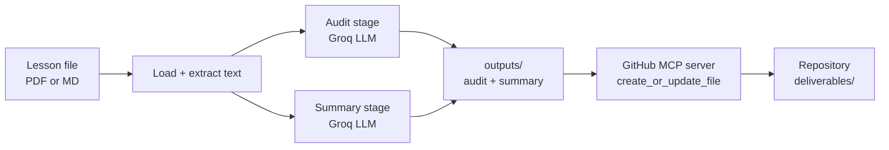

# Lesson Deliverable Agent

An AI agent that turns a course lesson into two ready-to-use deliverables and commits them to GitHub on its own, via the Model Context Protocol.

## Why this exists

Every lesson in my bootcamp generates the same manual workflow: read the material, check it for errors, write a structured summary, and file a product-management reference. That is repetitive, and repetitive work that follows a fixed shape is exactly what an agent should own.

This project automates that workflow end to end. As a product manager, the point was not to write production code, it was to identify a recurring process, specify it clearly, and orchestrate existing tools into a pipeline that does the job. The agent reads a lesson, audits it, summarizes it in a fixed house format, and publishes the result to a repository without a human running git.

## What it does

Given a single lesson file (PDF or markdown), the agent:

1. **Loads** the document and extracts its text.
2. **Audits** it for factual and conceptual errors, ranked by business impact.
3. **Summarizes** it in a fixed markdown format (date header, structured sections, key learning).
4. **Commits** the deliverables straight to GitHub through the GitHub MCP server.

## Architecture



The orchestrator (`src/agent.py`) runs the audit and summary stages, and the MCP step (`src/mcp_commit.py`) publishes the output. The commit happens through the protocol, independent of local git, so the agent acts as its own author in the repository.

## MCP integration

The publishing step connects to GitHub's remote MCP server at `https://api.githubcopilot.com/mcp/`, authenticates with a fine-grained personal access token, and calls the `create_or_update_file` tool. This is a real Model Context Protocol client talking to a real MCP server, not a wrapper around the REST API.

## Tech stack

- **Groq** for fast LLM inference (Llama 3.3 70B)
- **pypdf** for document text extraction
- **mcp** Python SDK as the MCP client
- **GitHub MCP server** (remote) for publishing

## Setup

Requires Python 3.10 or newer.

```bash
python -m venv .venv
source .venv/bin/activate
pip install -r requirements.txt
```

Create a `.env` file with two keys:
- GROQ_API_KEY=your_groq_key
- GITHUB_PAT=your_fine_grained_token

The GitHub token needs **Contents: Read and write** permission, scoped to this repository.

## Usage

Run the full pipeline on a lesson:

```bash
python -m src.agent "inputs/your_lesson.pdf"
```

Publish a deliverable to GitHub via MCP:

```bash
python -m src.mcp_commit "outputs/your_summary.md"
```

## Known limitation and scope decision

The free Groq tier caps input at roughly 12,000 tokens per request. Lessons larger than that are currently truncated to fit, which means long documents are summarized from their opening section only. This was a deliberate decision to get a working end-to-end pipeline first rather than over-engineer the input handling before proving the concept. Document chunking, which would lift this limit, is the next planned feature.

## Roadmap

- Document chunking to remove the truncation limit
- Read lessons directly from Google Drive via MCP
- Configurable topic naming for output files